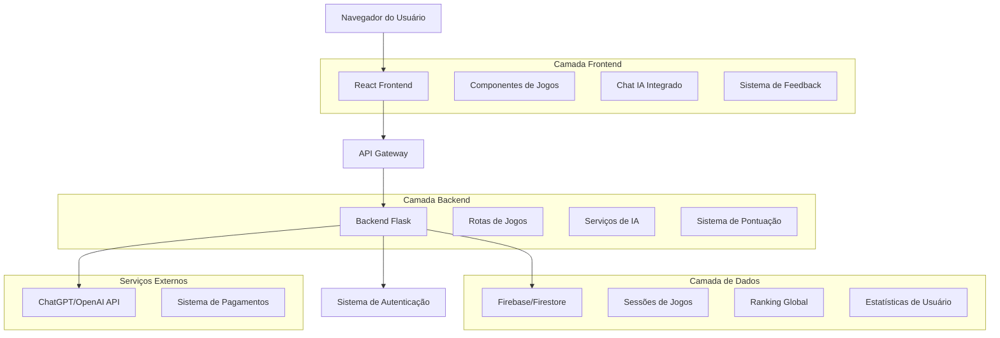
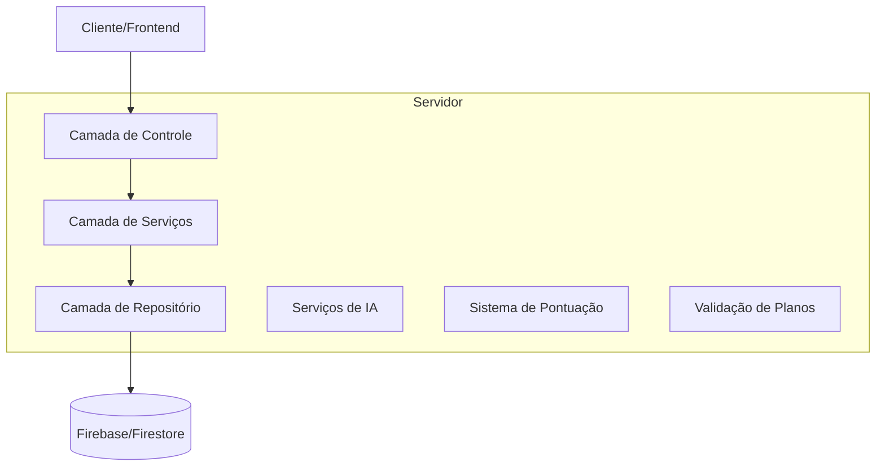
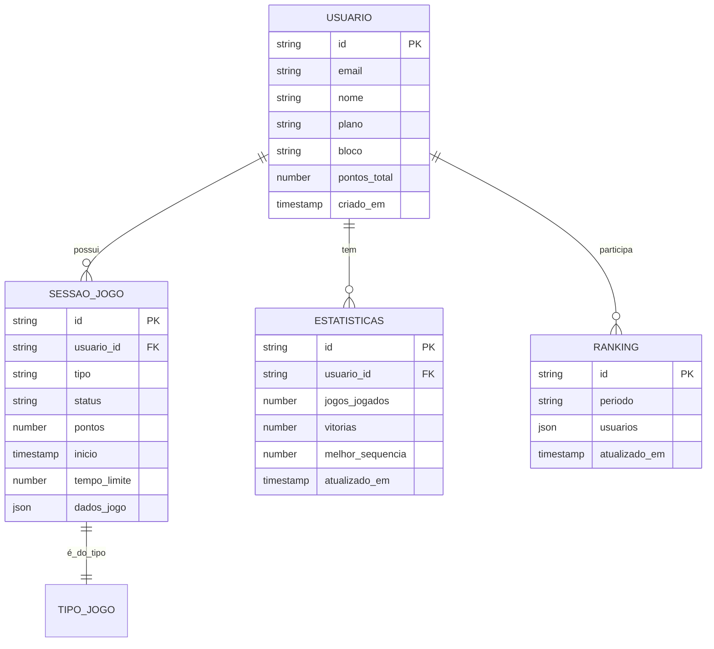

# Documento de Arquitetura Técnica - Melhorias Simulado PECLEST e Sistema de Jogos

## 1. Arquitetura do Sistema



## 2. Descrição das Tecnologias

* **Frontend**: React\@18 + TypeScript + Tailwind CSS + Vite

* **Backend**: Flask + Python (já implementado)

* **Banco de Dados**: Firebase/Firestore

* **IA**: OpenAI GPT-4 para geração de conteúdo e feedback

* **Autenticação**: Firebase Auth

* **Hospedagem**: Vercel (Frontend) + Render (Backend)

## 3. Definições de Rotas

| Rota                     | Propósito                                        |
| ------------------------ | ------------------------------------------------ |
| /simulado                | Página de simulado melhorada com sistema PECLEST |
| /jogos                   | Página principal dos jogos educativos            |
| /jogos/forca             | Interface do Jogo da Forca                       |
| /jogos/quiz              | Interface do Quiz Rápido                         |
| /jogos/memoria           | Interface do Jogo da Memória                     |
| /jogos/palavras-cruzadas | Interface das Palavras Cruzadas                  |
| /jogos/roleta            | Interface da Roleta da Sorte                     |
| /ranking                 | Ranking global dos jogos                         |

## 4. Definições de API

### 4.1 APIs Principais dos Jogos

**Listar jogos disponíveis**

```
GET /api/jogos/listar?usuario_id={id}
```

Request:

| Nome do Parâmetro | Tipo   | Obrigatório | Descrição            |
| ----------------- | ------ | ----------- | -------------------- |
| usuario\_id       | string | true        | ID do usuário logado |

Response:

| Nome do Parâmetro | Tipo   | Descrição                          |
| ----------------- | ------ | ---------------------------------- |
| jogos             | array  | Lista de jogos com disponibilidade |
| plano\_atual      | string | Plano atual do usuário             |

Exemplo:

```json
{
  "jogos": [
    {
      "id": "forca",
      "nome": "Jogo da Forca",
      "descricao": "Descubra palavras do seu bloco",
      "disponivel": true
    }
  ],
  "plano_atual": "premium"
}
```

**Iniciar sessão de jogo**

```
POST /api/jogos/iniciar/{tipo_jogo}
```

Request:

| Nome do Parâmetro | Tipo   | Obrigatório | Descrição                         |
| ----------------- | ------ | ----------- | --------------------------------- |
| usuario\_id       | string | true        | ID do usuário                     |
| bloco             | string | false       | Bloco de concurso (padrão: geral) |
| dificuldade       | string | false       | Nível de dificuldade              |

Response:

| Nome do Parâmetro | Tipo    | Descrição              |
| ----------------- | ------- | ---------------------- |
| sessao\_id        | string  | ID da sessão criada    |
| jogo              | object  | Dados iniciais do jogo |
| sucesso           | boolean | Status da operação     |

**Processar jogada**

```
POST /api/jogos/jogada
```

Request:

| Nome do Parâmetro | Tipo   | Obrigatório | Descrição                  |
| ----------------- | ------ | ----------- | -------------------------- |
| sessao\_id        | string | true        | ID da sessão               |
| jogada            | object | true        | Dados da jogada do usuário |

Response:

| Nome do Parâmetro | Tipo    | Descrição                         |
| ----------------- | ------- | --------------------------------- |
| resultado         | string  | Resultado da jogada (acerto/erro) |
| pontos            | number  | Pontos ganhos/perdidos            |
| jogo\_finalizado  | boolean | Se o jogo terminou                |
| feedback          | string  | Mensagem de feedback              |

### 4.2 APIs do Sistema PECLEST

**Chat IA para simulados**

```
POST /api/simulado/chat
```

Request:

| Nome do Parâmetro | Tipo   | Obrigatório | Descrição                          |
| ----------------- | ------ | ----------- | ---------------------------------- |
| usuario\_id       | string | true        | ID do usuário                      |
| questao\_id       | string | true        | ID da questão atual                |
| tipo\_ajuda       | string | true        | macete/pontos\_centrais/exploracao |
| contexto          | string | false       | Contexto adicional                 |

Response:

| Nome do Parâmetro | Tipo   | Descrição           |
| ----------------- | ------ | ------------------- |
| resposta          | string | Resposta da IA      |
| tipo              | string | Tipo de resposta    |
| referencias       | array  | Links e referências |

**Feedback de questão**

```
POST /api/simulado/feedback
```

Request:

| Nome do Parâmetro | Tipo    | Obrigatório | Descrição                    |
| ----------------- | ------- | ----------- | ---------------------------- |
| questao\_id       | string  | true        | ID da questão                |
| resposta\_usuario | number  | true        | Índice da resposta escolhida |
| resposta\_correta | number  | true        | Índice da resposta correta   |
| acertou           | boolean | true        | Se o usuário acertou         |

Response:

| Nome do Parâmetro | Tipo   | Descrição                          |
| ----------------- | ------ | ---------------------------------- |
| mensagem          | string | Mensagem de feedback personalizada |
| explicacao        | string | Explicação detalhada (se errou)    |
| dicas             | array  | Dicas para melhoria                |

## 5. Arquitetura do Servidor



## 6. Modelo de Dados

### 6.1 Definição do Modelo de Dados



### 6.2 Linguagem de Definição de Dados

**Coleção de Usuários (users)**

```javascript
// Estrutura no Firestore
{
  id: "user_123",
  email: "usuario@email.com",
  nome: "João Silva",
  plano: "premium", // trial, premium, ate_final_concurso
  bloco: "saude",
  estatisticas_jogos: {
    pontos_total: 1250,
    jogos_jogados: 45,
    vitorias: 32,
    melhor_sequencia: 8
  },
  roleta: {
    tentativas_hoje: 2,
    ultima_tentativa: "2024-01-15T10:30:00Z",
    premios_ganhos: ["pontos_bonus", "jogo_gratis"]
  },
  criado_em: "2024-01-01T00:00:00Z"
}
```

**Coleção de Sessões de Jogos (sessoes\_jogos)**

```javascript
{
  id: "sessao_456",
  tipo: "forca", // forca, quiz, memoria, palavras_cruzadas
  usuario_id: "user_123",
  bloco: "saude",
  status: "ativo", // ativo, finalizado, pausado
  pontos: 85,
  tempo_inicio: "2024-01-15T14:00:00Z",
  tempo_limite: 300, // segundos
  dados_jogo: {
    // Específico para cada tipo de jogo
    palavra_secreta: "ANATOMIA",
    letras_tentadas: ["A", "N", "T"],
    tentativas_restantes: 4
  }
}
```

**Coleção de Ranking (ranking\_jogos)**

```javascript
{
  id: "ranking_semanal_2024_03",
  periodo: "semanal",
  usuarios: [
    {
      usuario_id: "user_123",
      nome: "João Silva",
      pontos: 1250,
      jogos_jogados: 45,
      posicao: 1
    }
  ],
  atualizado_em: "2024-01-15T23:59:59Z"
}
```

**Índices Necessários**

```javascript
// Índices para otimização de consultas
db.sessoes_jogos.createIndex({ "usuario_id": 1, "status": 1 });
db.sessoes_jogos.createIndex({ "tipo": 1, "tempo_inicio": -1 });
db.ranking_jogos.createIndex({ "periodo": 1, "atualizado_em": -1 });
db.users.createIndex({ "plano": 1, "bloco": 1 });
```

## 7. Considerações de Segurança

* Validação de planos no backend antes de permitir acesso aos jogos

* Rate limiting para APIs de IA (ChatGPT)

* Sanitização de inputs do usuário

* Tokens JWT para autenticação de sessões

* Regras de segurança do Firestore para acesso aos dados

## 8. Performance e Escalabilidade

* Cache de sessões ativas em memória

* Lazy loading de componentes de jogos

* Otimização de imagens e assets

* CDN para recursos estáticos

* Paginação em rankings e históricos

