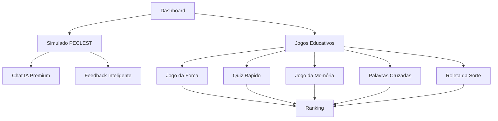

# Documento de Requisitos do Produto - Melhorias do Simulado PECLEST e Sistema de Jogos

## 1. Visão Geral do Projeto

Este documento especifica as melhorias necessárias para o sistema de simulados com funcionalidades PECLEST e a implementação completa do sistema de jogos educativos no frontend do Gabarita.AI. O objetivo é criar uma experiência gamificada e inteligente que maximize o engajamento e aprendizado dos usuários através de feedback personalizado e jogos educativos.

## 2. Funcionalidades Principais

### 2.1 Papéis de Usuário

| Papel                 | Método de Registro    | Permissões Principais                                        |
| --------------------- | --------------------- | ------------------------------------------------------------ |
| Trial (Gratuito)      | Email + senha         | Simulados básicos, Jogo da Forca                             |
| Premium               | Upgrade via pagamento | Todos os simulados + chat IA, Todos os jogos + Roleta 3x/dia |
| Até Final do Concurso | Upgrade premium       | Acesso completo + Roleta 5x/dia + prêmios especiais          |

### 2.2 Módulos de Funcionalidades

Nossos requisitos consistem nas seguintes páginas principais:

1. **Simulado Melhorado**: sistema PECLEST com feedback inteligente, chat de IA integrado, mensagens de incentivo e explicações detalhadas.
2. **Jogos Educativos**: página principal com 5 tipos de jogos (Forca, Quiz, Memória, Palavras Cruzadas, Roleta da Sorte).
3. **Sistema de Ranking**: classificações globais e estatísticas de jogos.

### 2.3 Detalhes das Páginas

| Nome da Página    | Nome do Módulo         | Descrição da Funcionalidade                                                                                |
| ----------------- | ---------------------- | ---------------------------------------------------------------------------------------------------------- |
| Simulado PECLEST  | Sistema de Feedback    | Exibir mensagens de parabéns para acertos, explicações detalhadas para erros, validação inteligente via IA |
| Simulado PECLEST  | Chat de IA Integrado   | Chat contextual com botões: Macete, Pontos Centrais, Explorações da Banca (apenas Premium/Até Final)       |
| Simulado PECLEST  | Interface de Questões  | Melhorar UX com animações de feedback, indicadores visuais de acerto/erro                                  |
| Jogos Principal   | Lista de Jogos         | Exibir jogos disponíveis por plano, cards com descrições, status de bloqueio/desbloqueio                   |
| Jogo da Forca     | Interface do Jogo      | Teclado virtual, palavra oculta, contador de tentativas, sistema de pontuação                              |
| Quiz Rápido       | Interface do Quiz      | Questões múltipla escolha, timer, feedback imediato, progresso visual                                      |
| Jogo da Memória   | Interface da Memória   | Grid de cartas, sistema de pares, timer, animações de flip                                                 |
| Palavras Cruzadas | Interface das Palavras | Grid interativo, dicas, validação de palavras, sistema de ajuda                                            |
| Roleta da Sorte   | Interface da Roleta    | Animação de roleta, sistema de prêmios, controle de tentativas diárias                                     |
| Ranking de Jogos  | Classificações         | Tabela de líderes, estatísticas pessoais, filtros por período e jogo                                       |

## 3. Fluxo Principal de Usuário

### Fluxo do Simulado PECLEST:

1. Usuário acessa simulado e configura parâmetros
2. Durante as questões: recebe feedback inteligente (parabéns/explicações)
3. Usuários Premium/Até Final: podem usar chat IA com botões especializados
4. Ao finalizar: visualiza relatório detalhado com insights de IA

### Fluxo dos Jogos:

1. Usuário acessa página de jogos
2. Visualiza jogos disponíveis baseado no seu plano
3. Seleciona um jogo e inicia sessão
4. Joga com feedback em tempo real
5. Recebe pontuação e pode acessar ranking
6. Usuários Premium: podem usar Roleta da Sorte

## 4. Design da Interface do Usuário

### 4.1 Estilo de Design

* **Cores Primárias**: Azul (#3B82F6), Verde (#10B981) para sucessos, Vermelho (#EF4444) para erros

* **Cores Secundárias**: Cinza (#6B7280), Roxo (#8B5CF6) para gamificação

* **Estilo dos Botões**: Arredondados com gradientes suaves, efeitos hover animados

* **Fontes**: Inter (títulos), System UI (corpo), tamanhos 14px-24px

* **Layout**: Cards com sombras suaves, espaçamento generoso, design mobile-first

* **Ícones**: Lucide React com animações CSS, estilo outline

### 4.2 Visão Geral do Design das Páginas

| Nome da Página    | Nome do Módulo        | Elementos da UI                                                                              |
| ----------------- | --------------------- | -------------------------------------------------------------------------------------------- |
| Simulado PECLEST  | Feedback de Questões  | Cards animados com ícones de check/x, cores dinâmicas (verde/vermelho), tipografia destacada |
| Simulado PECLEST  | Chat IA               | Sidebar flutuante, botões com gradientes, histórico de conversas, indicadores de typing      |
| Jogos Principal   | Grid de Jogos         | Cards com imagens, badges de plano, botões CTA coloridos, indicadores de progresso           |
| Jogo da Forca     | Interface Principal   | Teclado virtual responsivo, palavra com underlines animados, boneco da forca SVG             |
| Quiz Rápido       | Interface de Questões | Progress bar animada, botões de opção com hover effects, timer circular                      |
| Jogo da Memória   | Grid de Cartas        | Cards com flip animation 3D, efeitos de glow para matches, contador visual                   |
| Palavras Cruzadas | Grid Interativo       | Células editáveis com focus states, numeração clara, painel de dicas lateral                 |
| Roleta da Sorte   | Animação da Roleta    | SVG animado com CSS, botão de girar com pulse effect, modal de prêmios                       |

### 4.3 Responsividade

O produto é mobile-first com adaptação completa para desktop. Inclui otimizações para touch em dispositivos móveis, gestos de swipe nos jogos e layout flexível que se adapta a diferentes tamanhos de tela.

## 5. Integrações Técnicas Necessárias

### 5.1 APIs do Backend (Já Implementadas)

* `POST /api/jogos/iniciar` - Iniciar nova sessão de jogo

* `POST /api/jogos/jogada` - Processar jogada do usuário

* `GET /api/jogos/sessao/{id}` - Obter estado atual da sessão

* `POST /api/jogos/finalizar` - Finalizar jogo e calcular pontuação

* `POST /api/jogos/roleta` - Sistema da roleta da sorte

* `GET /api/jogos/ranking` - Ranking de jogadores

* `GET /api/jogos/listar` - Listar jogos disponíveis por plano

### 5.2 Funcionalidades PECLEST para Simulado

* Integração com ChatGPT para feedback contextual

* Sistema de validação inteligente de respostas

* Chat IA com prompts especializados (Macete, Pontos Centrais, Explorações)

* Análise de padrões de erro para recomendações personalizadas

### 5.3 Sistema de Controle por Planos

* **Trial**: Acesso apenas ao Jogo da Forca

* **Premium**: Todos os jogos + Chat IA + Roleta 3x/dia

* **Até Final do Concurso**: Acesso completo + Roleta 5x/dia + prêmios especiais

## 6. Critérios de Sucesso

* Aumento de 40% no tempo de sessão dos usuários

* Redução de 25% na taxa de abandono durante simulados

* Aumento de 60% na conversão de Trial para Premium

* Melhoria de 30% nas notas dos simulados através do feedback IA

* Engajamento diário de 80% dos usuários Premium nos jogos

