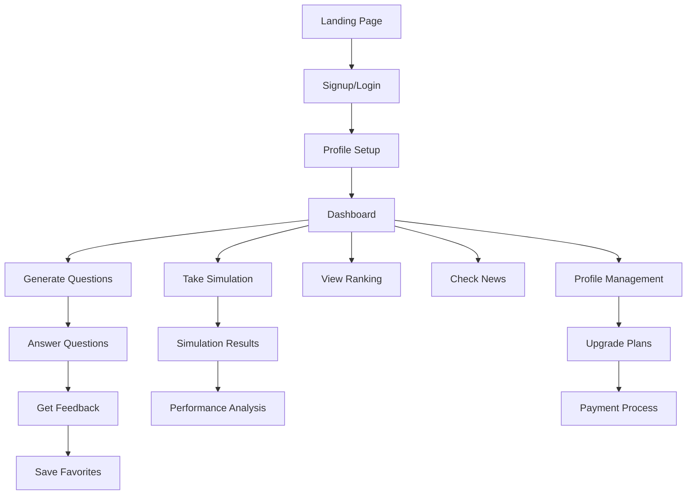

# Gabarita.AI - Product Requirements Document (PRD)

**Frontend Reconstruction with Notion/ChatGPT Style Design**

**Autor:** SOLO Document\
**Data:** Janeiro 2025\
**Versão:** 2.0

## 1. Product Overview

O Gabarita.AI é uma plataforma inteligente de preparação para concursos públicos, especificamente o Concurso Nacional Unificado (CNU 2025), que utiliza IA para gerar questões personalizadas e fornecer feedback educativo detalhado.

O frontend será reconstruído com design moderno inspirado no Notion e ChatGPT, priorizando uma experiência estudantil intuitiva, clean e focada na produtividade. A plataforma resolve o problema da falta de material personalizado para concursos, oferecendo questões adaptadas ao perfil do candidato e feedback inteligente para acelerar o aprendizado.

O produto visa capturar o mercado de preparação para concursos públicos, estimado em R$ 2 bilhões anuais no Brasil, com foco inicial no CNU 2025.

## 2. Core Features

### 2.1 User Roles

| Role              | Registration Method   | Core Permissions                                                                   |
| ----------------- | --------------------- | ---------------------------------------------------------------------------------- |
| Estudante Free    | Email + dados básicos | Acesso limitado a questões, dashboard básico, ranking público                      |
| Estudante Premium | Upgrade via pagamento | Questões ilimitadas, simulados completos, feedback IA, estatísticas avançadas      |
| Estudante Pro     | Plano anual premium   | Todos os recursos premium + chat com IA, materiais exclusivos, suporte prioritário |

### 2.2 Feature Module

Nossa plataforma de estudos consiste nas seguintes páginas principais:

1. **Home/Landing**: hero section com valor da plataforma, demonstração interativa, depoimentos, call-to-action para cadastro.
2. **Dashboard**: visão geral do progresso, estatísticas de desempenho, metas diárias, atividade recente, acesso rápido às funcionalidades.
3. **Questões**: interface principal de estudo com geração de questões personalizadas, feedback inteligente, sistema de favoritos.
4. **Simulados**: ambiente de prova cronometrada, relatórios detalhados de desempenho, comparação com outros usuários.
5. **Perfil**: gerenciamento de dados pessoais, configurações de estudo, histórico de atividades, preferências de notificação.
6. **Planos**: apresentação dos planos disponíveis, comparação de recursos, processo de upgrade, histórico de pagamentos.
7. **Ranking**: classificação por cargo/bloco, estatísticas comparativas, sistema de conquistas e badges.
8. **Notícias**: atualizações sobre o CNU 2025, dicas de estudo, mudanças no edital, calendário de provas.
9. **Ajuda/FAQ**: sistema de ajuda inteligente com IA, tutoriais interativos, suporte técnico.

### 2.3 Page Details

| Page Name    | Module Name          | Feature description                                                                     |
| ------------ | -------------------- | --------------------------------------------------------------------------------------- |
| Home/Landing | Hero Section         | Display value proposition, interactive demo, social proof with testimonials             |
| Home/Landing | Features Showcase    | Highlight key features with animations, comparison with competitors                     |
| Home/Landing | Pricing Preview      | Show plans overview, free trial CTA, success stories                                    |
| Dashboard    | Status Overview      | Show current life/health, study streak, daily progress, quick stats                     |
| Dashboard    | Performance Charts   | Display accuracy trends, subject performance, time analytics with interactive graphs    |
| Dashboard    | Quick Actions        | Generate questions, start simulation, view favorites, access recent activities          |
| Dashboard    | Goals & Achievements | Track daily/weekly goals, unlock badges, progress towards target score                  |
| Questões     | Question Generator   | Create personalized questions based on user profile, subject selection, difficulty      |
| Questões     | Question Interface   | Display question with clean layout, multiple choice options, timer, navigation          |
| Questões     | Feedback System      | Show detailed explanations, related topics, study materials, AI-powered insights        |
| Questões     | Favorites Management | Save questions, organize by topics, schedule reviews, export lists                      |
| Simulados    | Simulation Setup     | Configure number of questions, time limits, subject focus, difficulty level             |
| Simulados    | Exam Environment     | Full-screen mode, timer, question navigation, submission controls                       |
| Simulados    | Results Analysis     | Detailed performance report, comparison with previous attempts, improvement suggestions |
| Perfil       | Personal Information | Edit name, email, CPF, target position, study preferences                               |
| Perfil       | Study Settings       | Configure notifications, study schedule, difficulty preferences, subject priorities     |
| Perfil       | Activity History     | View all answered questions, simulation history, progress timeline                      |
| Planos       | Plans Comparison     | Display all available plans, feature comparison table, pricing information              |
| Planos       | Payment Processing   | Secure payment flow, multiple payment methods, subscription management                  |
| Planos       | Billing History      | View payment history, download invoices, manage subscriptions                           |
| Ranking      | Leaderboard          | Show position by cargo/bloco, filtering options, performance metrics                    |
| Ranking      | User Comparison      | Compare performance with similar users, identify improvement areas                      |
| Notícias     | News Feed            | Display latest CNU updates, study tips, exam calendar, official announcements           |
| Notícias     | Content Details      | Full article view, related links, sharing options, bookmark functionality               |
| Ajuda/FAQ    | AI Assistant         | Intelligent help system, natural language queries, contextual suggestions               |
| Ajuda/FAQ    | Knowledge Base       | Searchable help articles, video tutorials, troubleshooting guides                       |
| Login/Signup | Authentication       | Email/password login, social login options, password recovery                           |
| Login/Signup | Registration         | Multi-step signup, profile setup, email verification, onboarding flow                   |

## 3. Core Process

**Fluxo do Estudante:**

1. Usuário acessa a landing page e se cadastra
2. Completa o perfil com cargo e bloco desejado
3. Acessa o dashboard e visualiza seu progresso inicial
4. Gera questões personalizadas baseadas no seu perfil
5. Responde questões e recebe feedback inteligente
6. Realiza simulados cronometrados para praticar
7. Acompanha seu progresso no ranking e estatísticas
8. Considera upgrade para planos premium conforme necessidade

**Fluxo de Estudo Diário:**

1. Login → Dashboard com metas diárias
2. Geração de questões → Resolução com feedback
3. Revisão de favoritos → Simulado semanal
4. Análise de desempenho → Ajuste de estratégia

## 4. User Interface Design

### 4.1 Design Style

**Color Palette:**

* Primary: #2563EB (Blue 600) - Professional and trustworthy

* Secondary: #10B981 (Emerald 500) - Success and progress

* Accent: #F59E0B (Amber 500) - Attention and highlights

* Background: #F8FAFC (Slate 50) - Clean and minimal

* Text: #1E293B (Slate 800) - High contrast readability

* Muted: #64748B (Slate 500) - Secondary text

**Typography:**

* Primary Font: Inter (clean, modern, excellent readability)

* Headings: 24px-32px, font-weight 600-700

* Body Text: 16px, font-weight 400

* Small Text: 14px, font-weight 400

**Component Style:**

* Buttons: Rounded corners (8px), subtle shadows, hover animations

* Cards: Clean white background, subtle borders, 12px border-radius

* Layout: Notion-inspired sidebar navigation, ChatGPT-style content areas

* Icons: Lucide React icons for consistency

* Animations: Smooth transitions, micro-interactions, loading states

### 4.2 Page Design Overview

| Page Name | Module Name       | UI Elements                                                                                 |
| --------- | ----------------- | ------------------------------------------------------------------------------------------- |
| Dashboard | Main Layout       | Sidebar navigation (240px), main content area, floating action buttons, progress indicators |
| Dashboard | Stats Cards       | Clean white cards with colored accents, large numbers, trend indicators, hover effects      |
| Dashboard | Charts            | Interactive charts with Recharts, smooth animations, tooltips, responsive design            |
| Questões  | Question Card     | Centered card layout, clean typography, radio buttons with custom styling, progress bar     |
| Questões  | Feedback Panel    | Expandable panel, syntax highlighting for explanations, related links, bookmark button      |
| Simulados | Timer Interface   | Prominent countdown timer, progress indicator, question navigation sidebar                  |
| Simulados | Results Dashboard | Performance metrics cards, comparison charts, improvement suggestions panel                 |
| Perfil    | Form Layout       | Two-column layout, grouped form fields, inline validation, save indicators                  |
| Planos    | Pricing Cards     | Three-column layout, highlighted popular plan, feature comparison table, CTA buttons        |
| Ranking   | Leaderboard Table | Sortable table, user highlighting, performance badges, filtering controls                   |
| Notícias  | Feed Layout       | Card-based layout, featured articles, infinite scroll, category filters                     |

### 4.3 Responsiveness

A plataforma é **desktop-first** com adaptação completa para mobile:

* **Desktop (1024px+)**: Layout completo com sidebar, múltiplas colunas

* **Tablet (768px-1023px)**: Sidebar colapsível, layout adaptado

* **Mobile (320px-767px)**: Navigation drawer, layout em coluna única, touch-optimized

**Touch Interactions:**

* Botões com área mínima de 44px

* Swipe gestures para navegação

* Pull-to-refresh em listas

* Haptic feedback em

