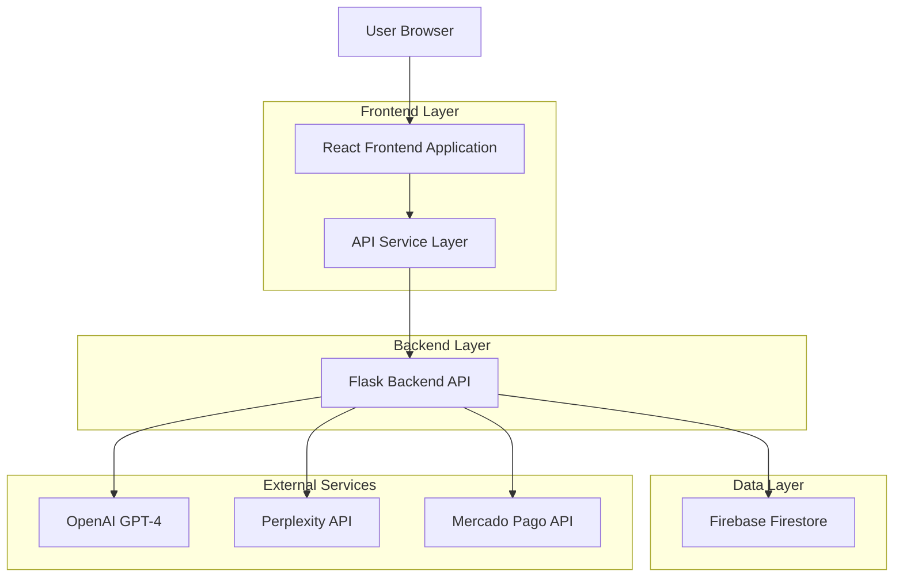
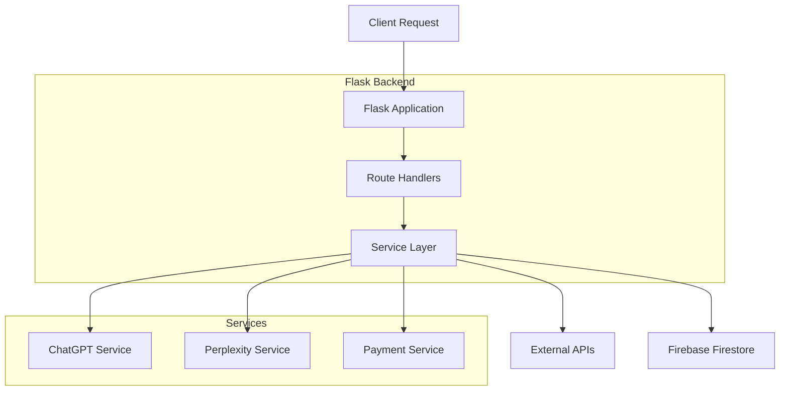
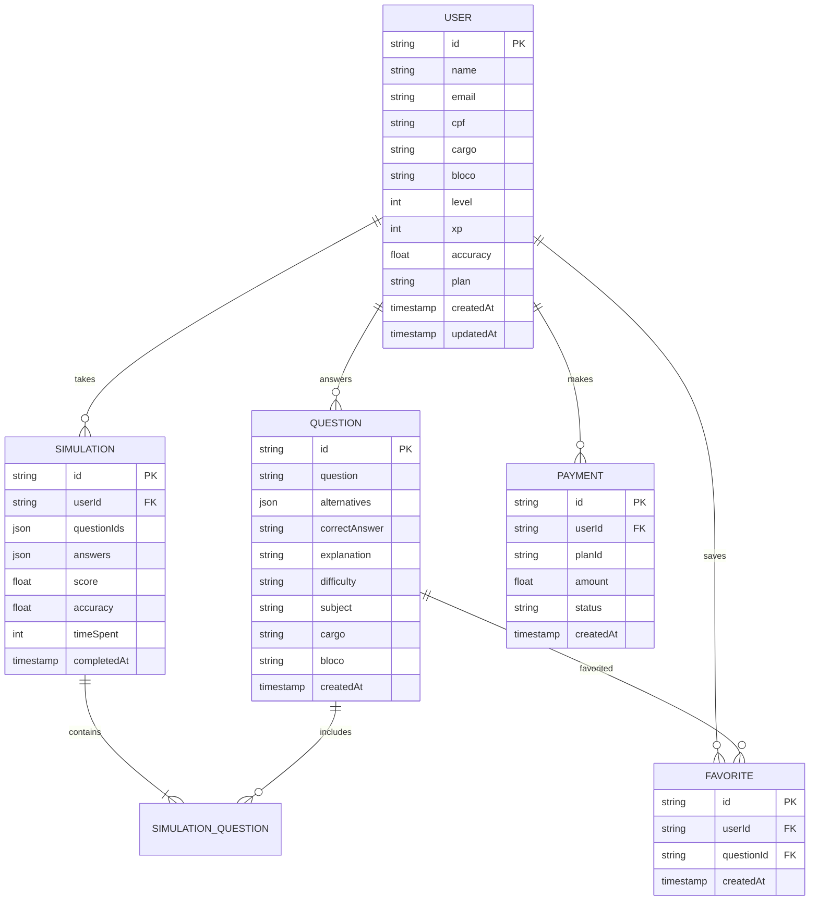

# Gabarita.AI - Technical Architecture Document

**Frontend Reconstruction with Modern Stack**

**Autor:** SOLO Document\
**Data:** Janeiro 2025\
**Versão:** 2.0

## 1. Architecture Design



## 2. Technology Description

* **Frontend**: React\@18 + TypeScript + Tailwind CSS\@3 + Vite + Lucide React Icons

* **Backend**: Flask + Python 3.9 + Firebase Admin SDK

* **Database**: Firebase Firestore (NoSQL)

* **External APIs**: OpenAI GPT-4, Perplexity, Mercado Pago

* **Authentication**: Firebase Authentication

* **Deployment**: Frontend (Vercel), Backend (Render)

## 3. Route Definitions

| Route      | Purpose                                                 |
| ---------- | ------------------------------------------------------- |
| /          | Landing page with hero section and product showcase     |
| /login     | User authentication page                                |
| /signup    | User registration with multi-step form                  |
| /dashboard | Main dashboard with progress overview and quick actions |
| /questoes  | Question generation and answering interface             |
| /simulados | Timed simulation environment and results                |
| /perfil    | User profile management and settings                    |
| /planos    | Subscription plans and payment processing               |
| /ranking   | Leaderboard and performance comparison                  |
| /noticias  | News feed and CNU updates                               |
| /ajuda     | Help system with AI assistant and FAQ                   |

## 4. API Definitions

### 4.1 Authentication APIs

**User Login**

```
POST /api/auth/login
```

Request:

| Param Name | Param Type | isRequired | Description        |
| ---------- | ---------- | ---------- | ------------------ |
| email      | string     | true       | User email address |
| password   | string     | true       | User password      |

Response:

| Param Name | Param Type | Description              |
| ---------- | ---------- | ------------------------ |
| success    | boolean    | Operation status         |
| data       | object     | User data and token      |
| data.user  | User       | User profile information |
| data.token | string     | JWT authentication token |
| error      | string     | Error message if failed  |

Example Request:

```json
{
  "email": "usuario@email.com",
  "password": "senha123"
}
```

Example Response:

```json
{
  "success": true,
  "data": {
    "user": {
      "id": "user123",
      "name": "João Silva",
      "email": "usuario@email.com",
      "cargo": "Enfermeiro",
      "bloco": "Saúde",
      "plan": "free"
    },
    "token": "eyJhbGciOiJIUzI1NiIsInR5cCI6IkpXVCJ9..."
  }
}
```

**User Registration**

```
POST /api/auth/signup
```

Request:

| Param Name | Param Type | isRequired | Description            |
| ---------- | ---------- | ---------- | ---------------------- |
| name       | string     | true       | Full name              |
| email      | string     | true       | Email address          |
| password   | string     | true       | Password (min 6 chars) |
| cpf        | string     | false      | CPF number             |
| cargo      | string     | true       | Target position        |
| bloco      | string     | true       | Knowledge block        |

### 4.2 User Management APIs

**Get User Profile**

```
GET /api/user/profile
```

Headers:

| Header Name   | Value          |
| ------------- | -------------- |
| Authorization | Bearer {token} |

Response:

```json
{
  "success": true,
  "data": {
    "id": "user123",
    "name": "João Silva",
    "email": "usuario@email.com",
    "cargo": "Enfermeiro",
    "bloco": "Saúde",
    "level": 5,
    "xp": 1250,
    "accuracy": 78.5,
    "plan": "premium",
    "questionsAnswered": 156
  }
}
```

**Update User Profile**

```
PUT /api/user/profile
```

### 4.3 Questions APIs

**Generate Questions**

```
POST /api/questoes/gerar
```

Request:

| Param Name | Param Type | isRequired | Description                      |
| ---------- | ---------- | ---------- | -------------------------------- |
| cargo      | string     | true       | Target position                  |
| bloco      | string     | true       | Knowledge block                  |
| count      | number     | false      | Number of questions (default: 1) |
| difficulty | string     | false      | Difficulty level                 |

Response:

```json
{
  "success": true,
  "data": [
    {
      "id": "q-user123-20250123120000",
      "question": "Qual é o principal objetivo da Política Nacional de Saúde?",
      "alternatives": [
        {"id": "A", "text": "Garantir acesso universal à saúde"},
        {"id": "B", "text": "Reduzir custos hospitalares"},
        {"id": "C", "text": "Privatizar o sistema de saúde"},
        {"id": "D", "text": "Limitar atendimentos públicos"},
        {"id": "E", "text": "Centralizar decisões federais"}
      ],
      "correctAnswer": "A",
      "explanation": "A Política Nacional de Saúde tem como objetivo...",
      "difficulty": "medium",
      "subject": "Políticas Públicas de Saúde"
    }
  ],
  "message": "Questão gerada com sucesso"
}
```

**Answer Question**

```
POST /api/questoes/{questaoId}/responder
```

Request:

| Param Name | Param Type | isRequired | Description                     |
| ---------- | ---------- | ---------- | ------------------------------- |
| resposta   | string     | true       | Selected answer (A, B, C, D, E) |

Response:

```json
{
  "success": true,
  "correto": true,
  "gabarito": "A",
  "explicacao": "Explicação detalhada da resposta correta..."
}
```

### 4.4 Simulation APIs

**Submit Simulation**

```
POST /api/simulados/submit
```

Request:

| Param Name  | Param Type | isRequired | Description               |
| ----------- | ---------- | ---------- | ------------------------- |
| answers     | number\[]  | true       | Array of selected answers |
| questionIds | string\[]  | true       | Array of question IDs     |

### 4.5 Plans and Payment APIs

**Get Available Plans**

```
GET /api/planos
```

Response:

```json
{
  "success": true,
  "data": [
    {
      "id": "free",
      "nome": "Plano Gratuito",
      "descricao": "Acesso básico à plataforma",
      "preco": 0,
      "periodo": "mensal",
      "recursos": ["10 questões por dia", "Dashboard básico"],
      "popular": false
    },
    {
      "id": "premium",
      "nome": "Plano Premium",
      "descricao": "Acesso completo com IA",
      "preco": 29.90,
      "periodo": "mensal",
      "recursos": ["Questões ilimitadas", "Simulados completos", "Feedback IA"],
      "popular": true
    }
  ]
}
```

**Create Payment**

```
POST /api/pagamentos/criar
```

Request:

| Param Name | Param Type | isRequired | Description         |
| ---------- | ---------- | ---------- | ------------------- |
| plano      | string     | true       | Plan ID to purchase |

### 4.6 Options APIs

**Get Cargos and Blocos**

```
GET /api/opcoes/cargos-blocos
```

Response:

```json
{
  "success": true,
  "dados": {
    "todos_cargos": ["Enfermeiro", "Técnico em Enfermagem", "Médico"],
    "todos_blocos": ["Saúde", "Educação", "Gestão"],
    "cargos_blocos": {
      "Enfermeiro": ["Saúde"],
      "Técnico em Enfermagem": ["Saúde"],
      "Médico": ["Saúde"]
    }
  }
}
```

### 4.7 Performance and Ranking APIs

**Get User Performance**

```
GET /api/performance
```

**Get Ranking**

```
GET /api/ranking
```

### 4.8 News APIs

**Get Latest News**

```
GET /api/news
```

## 5. Server Architecture Diagram



## 6. Data Model

### 6.1 Data Model Definition



### 6.2 Data Definition Language

**Users Collection (Firebase Firestore)**

```javascript
// Collection: users
{
  id: "auto-generated-id",
  name: "João Silva",
  email: "joao@email.com",
  cpf: "12345678901",
  cargo: "Enfermeiro",
  bloco: "Saúde",
  level: 5,
  xp: 1250,
  accuracy: 78.5,
  plan: "premium",
  questionsAnswered: 156,
  createdAt: "2025-01-23T10:00:00Z",
  updatedAt: "2025-01-23T15:30:00Z"
}
```

**Questions Collection**

```javascript
// Collection: questions
{
  id: "q-user123-20250123120000",
  question: "Qual é o principal objetivo da Política Nacional de Saúde?",
  alternatives: [
    {id: "A", text: "Garantir acesso universal à saúde"},
    {id: "B", text: "Reduzir custos hospitalares"},
    {id: "C", text: "Privatizar o sistema de saúde"},
    {id: "D", text: "Limitar atendimentos públicos"},
    {id: "E", text: "Centralizar decisões federais"}
  ],
  correctAnswer: "A",
  explanation: "A Política Nacional de Saúde tem como objetivo...",
  difficulty: "medium",
  subject: "Políticas Públicas de Saúde",
  cargo: "Enfermeiro",
  bloco: "Saúde",
  createdAt: "2025-01-23T12:00:00Z"
}
```

**Simulations Collection**

```javascript
// Collection: simulations
{
  id: "sim-user123-20250123",
  userId: "user123",
  questionIds: ["q1", "q2", "q3", "q4", "q5"],
  answers: ["A", "B", "A", "C", "D"],
  score: 80,
  accuracy: 80.0,
  timeSpent: 900, // seconds
  completedAt: "2025-01-23T14:00:00Z"
}
```

**Favorites Collection**

```javascript
// Collection: favorites
{
  id: "fav-user123-q456",
  userId: "user123",
  questionId: "q456",
  category: "important",
  notes: "Revisar antes da prova",
  createdAt: "2025-01-23T16:00:00Z"
}
```

**Payments Collection**

```javascript
// Collection: payments
{
  id: "pay-user123-20250123",
  userId: "user123",
  planId: "premium",
  amount: 29.90,
  currency: "BRL",
  status: "completed",
  paymentMethod: "credit_card",
  mercadoPagoId: "mp-12345",
  createdAt: "2025-01-23T18:00:00Z"
}
```

## 7. Frontend Component Architecture

### 7.1 Component Structure

```
src/
├── components/
│   ├── ui/           # Reusable UI components
│   ├── layout/       # Layout components
│   ├── forms/        # Form components
│   └── charts/       # Chart components
├── pages/            # Page components
├── hooks/            # Custom React hooks
├── services/         # API services
├── types/            # TypeScript types
├── utils/            # Utility functions
└── styles/           # Global styles
```

### 7.2 Key Components

* **Layout**: Sidebar navigation, header, main content area

* **QuestionCard**: Question display with alternatives and feedback

* **Dashboard**: Stats cards, charts, quick actions

* **SimulationTimer**: Countdown timer with progress indicator

* **PerformanceChart**: Interactive charts for analytics

* **PlanCard**: Subscription plan display with features

* **NewsCard**: News article display with metadata

### 7.3 State Management

* **React Context**: User authentication, global settings

* **Local State**: Component-specific state with useState

* **Custom Hooks**: Reusable stateful logic

* **API State**: Managed through custom hooks with error handling

### 7.4 Styling Strategy

* **Tailwind CSS**: Utility-first CSS framework

* **Component Variants**: Using clsx for conditional classes

* **Design Tokens**: Consistent colors, spacing, typography

* **Responsive Design**: Mobile-first approach with breakpoints

